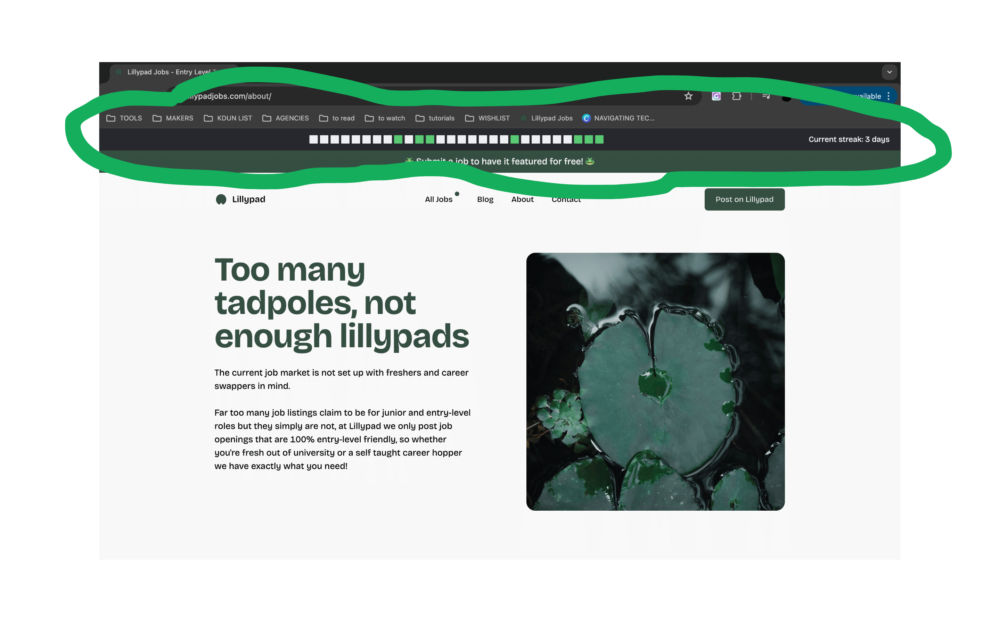
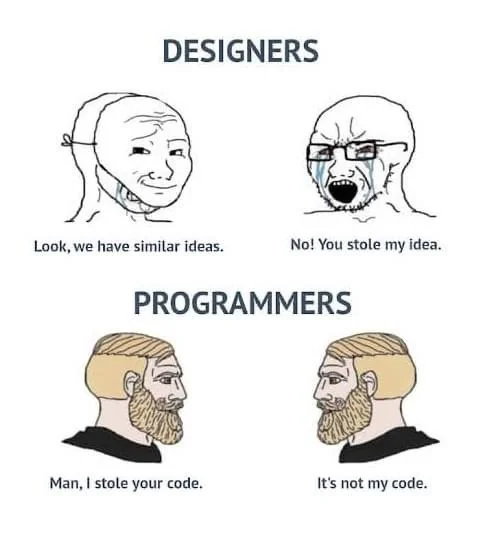

# GH-Streak

A Chrome extension that displays your recent GitHub contribution activity and current streak on (almost) every webpage you visit.

## About

Duolingo has me in a chokehold. I downloaded that app 123 days ago. My current streak is 123 days!
Turns out a bit of gamification and visual prompting will force my chaotic neurodivergent *** into consistency. This app is the first step in me trying to implement those things into my developer journey. 

A small Google Chrome extension that displays your last 28 days Github Contributions graph on a small bar showing up on almost every website. It's still buggy, but even when it doesn't look perfect (or show up at all for that matter due to individual website's settings), it still does the job of giving a more persistent visual prompt reminding one to be consistent.

## Screenshot



## Features

- Displays your GitHub contribution activity for the last 28 days
- Shows your current contribution streak
- Appears as a bar at the top of every webpage
- Updates daily based on your GitHub activity

## Installation

1. Clone this repository or download it as a ZIP file and extract it.

```
https://github.com/k-dun/GH-Streak.git
```

2. Open Google Chrome and navigate to `chrome://extensions/`

3. Enable "Developer mode" by toggling the switch in the top right corner.

4. Click "Load unpacked" and select the directory containing the extension files.

5. The extension should now be installed and active in your Chrome browser.

## Configuration

Before using the extension, you need to set your GitHub username:

1. Open the `background.js` file.
2. Locate the following line:

```javascript
fetch("https://github.com/users/YOUR_USERNAME/contributions")
```

3. Replace YOUR_USERNAME with your actual GitHub username.
4. Save the file and reload the extension in Chrome.

## File Structure

- manifest.json: Extension configuration file
- background.js: Handles fetching contribution data from GitHub
- content.js: Processes the contribution data and creates the display bar
- styles.css: Styles for the contribution bar and squares
- README.md: This file

## Development

To modify or extend this extension:

Make your changes to the relevant files.
If you modify manifest.json, you may need to reload the extension in Chrome.
For changes to other files, you can usually just refresh the webpage to see updates.

## Adding New Features

To add new features, focus on modifying content.js.
For style changes, update styles.css.
If you need to change how data is fetched, modify background.js.

## Troubleshooting

If the bar doesn't appear, check the console for error messages.
Ensure your GitHub username is correctly set in background.js.
If changes don't appear, try reloading the extension in Chrome.

### Strip Still Not Appearing on Specific Websites

If it still doesn't appear on certain websites take one of these two paths:

#### Path 1

1. Check if the website has a strict Content Security Policy.
2. Ensure the extension has permission to run on that website.
3. Check the browser console for any error messages.
4. Try disabling other extensions to rule out conflicts.
5. If the issue persists on a specific site, you can report it in the Issues section of this repository, but prior to doing that check Path 2.

#### Path 2

1. It is what it is. For example it displays very glitchy on Twitter, but seeing as I should spend less time on it anyway, it's a trade-off and a sacrifice I am personally willing to accept.

## Contributing

Contributions are welcome! Please feel free to submit a Pull Request, fork it, clone it or copy and paste. For more details check the below License.

## License



Do as you will! I am a big open-source fan anyway.